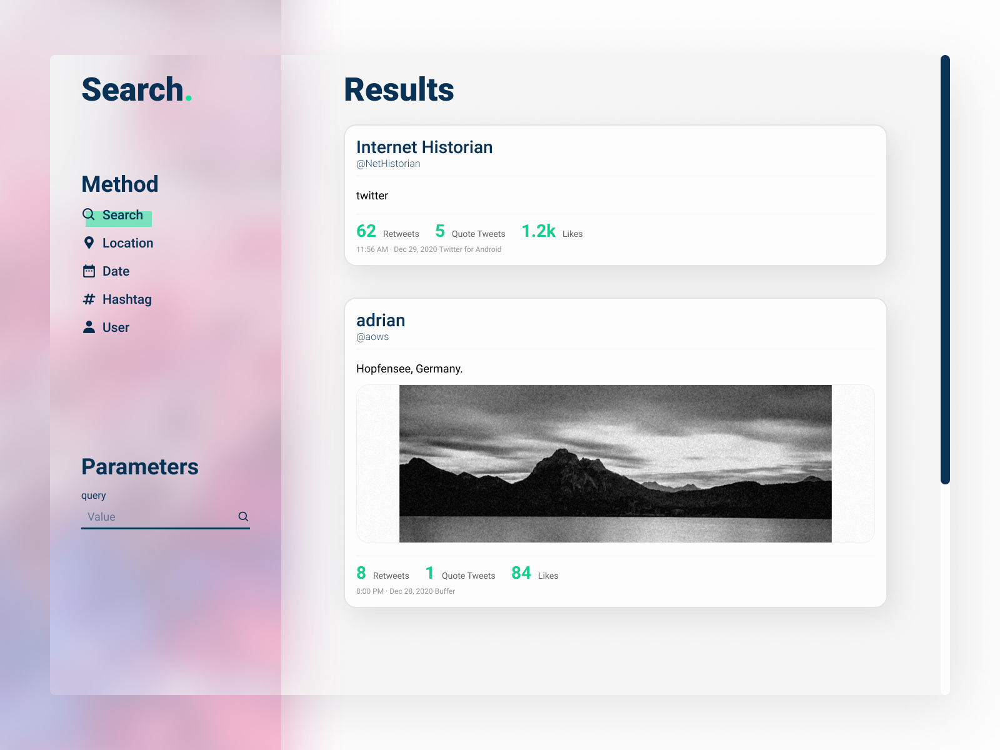

# TwitterFlitter

I created a GUI for interacting with the Twitter API. Built in C++ with openFrameworks. Learning the different endpoints that Twitter has available and how they could be utilised was the key takeaway for this project. There is so much more that could be done with the API than just this basic use of interaction. It was great to find out more about it.

### Original design

### Openframeworks C++ application.
Required addons:
* [ofxGeo](https://github.com/bakercp/ofxGeo)
* [ofxHTTP](https://github.com/bakercp/ofxHTTP)
* [ofxIO](ofxIO)
* [ofxMediaType](https://github.com/bakercp/ofxMediaType)
* [ofxNetworkUtils](https://github.com/bakercp/ofxNetworkUtils)
* ofxPoco - *included with openFrameworks*
* [ofxSSLManager](https://github.com/bakercp/ofxSSLManager)
* [ofxTwitter](https://github.com/bakercp/ofxTwitter)
* [ofxDatGui](https://github.com/braitsch/ofxDatGui)
* [ofxEasing](https://github.com/arturoc/ofxEasing)
* [ofxTrueTypeFontUC](https://github.com/hironishihara/ofxTrueTypeFontUC)
