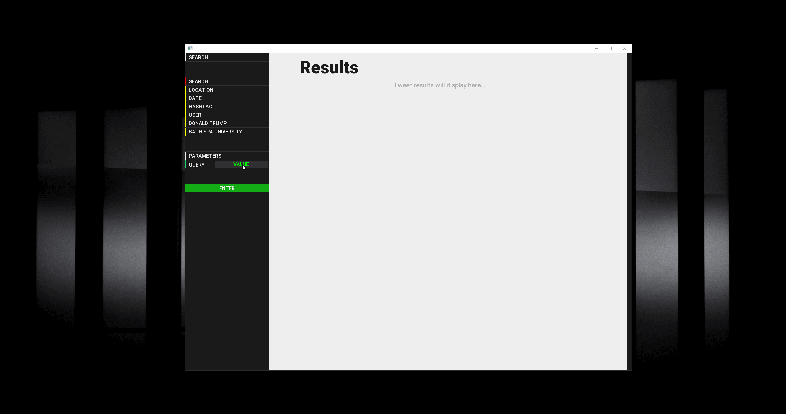

# TwitterFlitter

Created a GUI for interacting with the Twitter API. Built in C++ with openFrameworks.

### Original design

### Openframeworks C++ application.
Required addons:
* [ofxGeo](https://github.com/bakercp/ofxGeo)
* [ofxHTTP](https://github.com/bakercp/ofxHTTP)
* [ofxIO](ofxIO)
* [ofxMediaType](https://github.com/bakercp/ofxMediaType)
* [ofxNetworkUtils](https://github.com/bakercp/ofxNetworkUtils)
* ofxPoco - *included with openFrameworks*
* [ofxSSLManager](https://github.com/bakercp/ofxSSLManager)
* [ofxTwitter](https://github.com/bakercp/ofxTwitter)
* [ofxDatGui](https://github.com/braitsch/ofxDatGui)
* [ofxEasing](https://github.com/arturoc/ofxEasing)
* [ofxTrueTypeFontUC](https://github.com/hironishihara/ofxTrueTypeFontUC)
